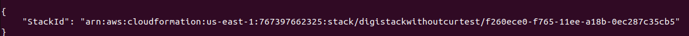
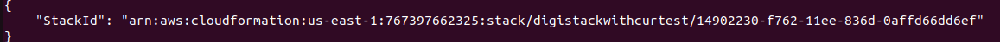
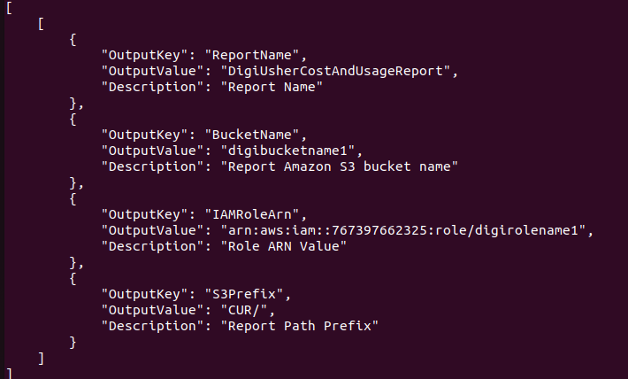

# DigiUsher CloudFormation Stack Creation

This README provides step-by-step instructions on how to create a CloudFormation stack using our provided templates tailored to your needs.

This repository hosts two CloudFormation templates: `CloudFormationWithCur` and `CloudFormationWithoutCur`. These templates are designed to automatically provision AWS resources based on specific requirements, ensuring seamless deployment for DigiUsher's projects.

## Instructions

1. **Download the Templates**:
   Clone this repository or download the CloudFormation templates `CloudFormationWithCur.yaml` and `CloudFormationWithoutCur.yaml` to get started.

2. **Choose Template**:
   Depending on whether you have Cost and Usage Reports (CUR) enabled in your AWS account, select the appropriate CloudFormation template:
   - If CUR is enabled, use `CloudFormationWithCur.yaml`.
   - If CUR is not enabled, use `CloudFormationWithoutCur.yaml`.

3. **Create CloudFormation Stack**:
   Choose one of the following methods to create your stack:

   - **Using AWS Management Console**:
     - Go to the CloudFormation service in the AWS Management Console.
     - Click on "Create stack" and select "With new resources (standard)".
     - Upload the chosen template and follow the on-screen instructions to specify stack details, skipping configuration of stack options, and proceed to create the stack.
        - Sample output after creating stack:
          - Without CUR 
             
          - With CUR
             
   - **Using AWS CLI**:
     Execute the commands below to create the stack:
     - For `CloudFormationWithoutCur`:
       ```
       aws cloudformation create-stack \
          --stack-name YourStackName \
          --template-body file://path/to/CloudFormationWithoutCur.yaml \
          --region us-east-1 \
          --parameters ParameterKey=RoleName,ParameterValue=YourRoleName \
                      ParameterKey=BucketName,ParameterValue=YourBucketName \
          --capabilities CAPABILITY_NAMED_IAM
       ```
       - Sample output after execution of the above command 
          
     - For `CloudFormationWithCur`:
       ```
       aws cloudformation create-stack \
           --stack-name YourStackName \
           --template-body file://path/to/CloudFormationWithCur.yaml \
           --parameters ParameterKey=RoleName,ParameterValue=YourRoleName \
           --capabilities CAPABILITY_NAMED_IAM
       ```
       - Sample output after execution of the above command 
        
     Ensure to replace `YourRoleName` and `YourBucketName` with appropriate values.

4. **Monitor Stack Creation**:
   Monitor the stack creation progress using either the AWS Management Console or AWS CLI:
   - AWS Management Console: Check the CloudFormation service for the stack status.
   - AWS CLI:
     ```
     aws cloudformation describe-stacks --stack-name YourStackName
     ```

5. **Navigate to Outputs**:
   After the stack creation is complete,
   - AWS Management Console: Navigate to the "Outputs" section in the CloudFormation stack details.
     - Sample output after creating stack:
          - Without CUR 
             
          - With CUR
             
   - AWS CLI:
     ```
     aws cloudformation describe-stacks --stack-name YourStackName --query 'Stacks[].Outputs'
     ```
     - Sample output after execution of the above command:
       - Without CUR
         
       - With CUR
         

6. **Fill in Output Values**:
   Utilize the provided output values and integrate them into your AWS ARN data source connections.

7. **Policy Attachment Requirement for AWS CLI Users**:
   If creating the stack through the AWS CLI, ensure your IAM user has the following policy attached:
   ```
   {
       "Version": "2012-10-17",
       "Statement": [
           {
               "Effect": "Allow",
               "Action": [
                   "cloudformation:*",
                   "s3:CreateBucket",
                   "s3:PutBucketPolicy",
                   "s3:PutObject",
                   "iam:CreateRole",
                   "iam:PutRolePolicy",
                   "iam:GetRole",
                   "cur:PutReportDefinition"
               ],
               "Resource": "*"
           }
       ]
   }