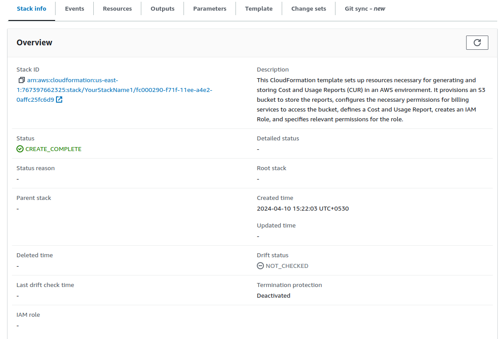
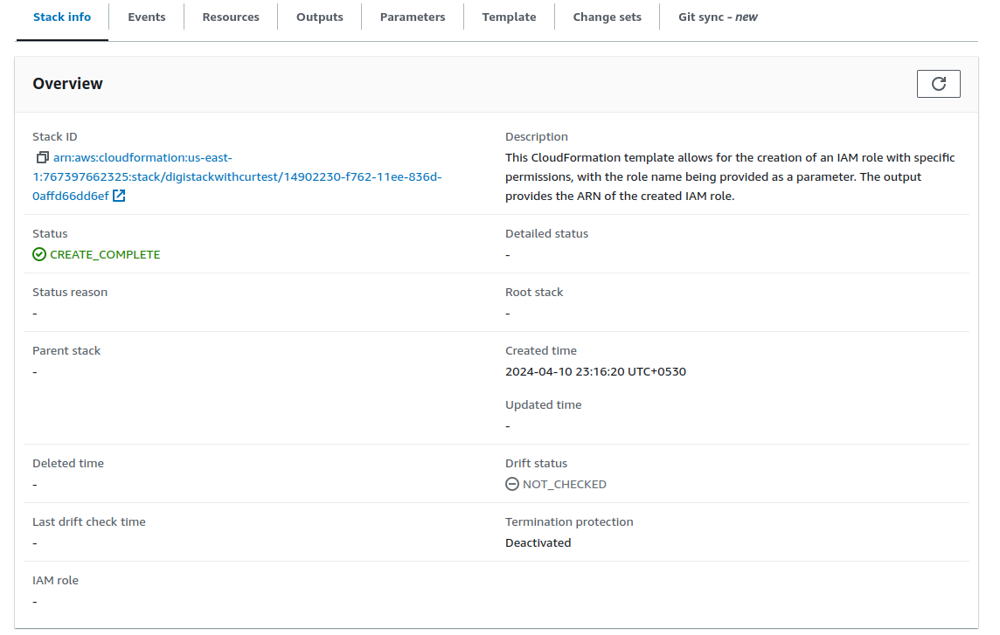
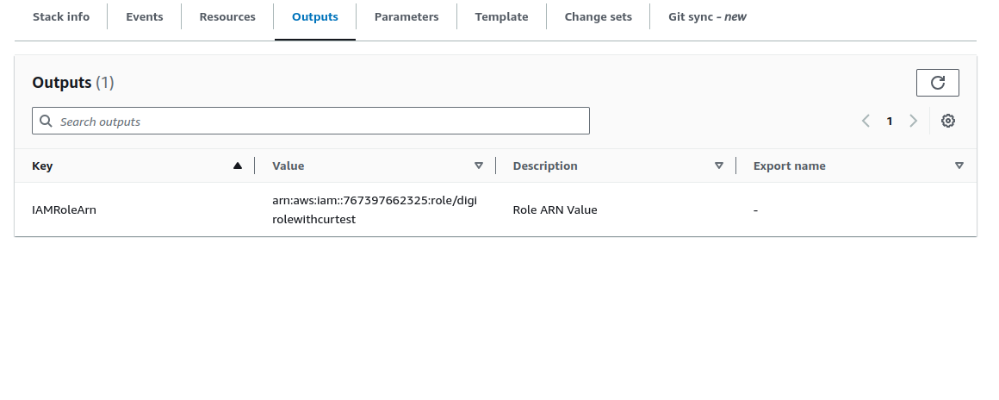
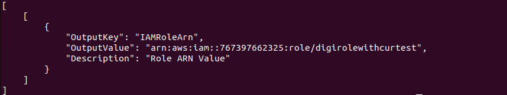

# DigiUsher CloudFormation Stack Creation

This README provides step-by-step instructions on how to create a CloudFormation stack using our provided templates tailored to your needs.

These templates are designed to automatically provision AWS resources based on specific requirements, ensuring seamless deployment for DigiUsher's projects.

First choose the Cloudformation template you will be using. Look at the parent [README](./README.md) for more information.

## Instructions

1. **Download the Templates**:
   Clone this repository or download the CloudFormation template to get started.

2. **Create CloudFormation Stack**:
   Choose one of the following methods to create your stack:

   - **Using AWS Management Console**:
     - Go to the CloudFormation service in the AWS Management Console.
     - Before proceeding, change the AWS Management Console's region to N. Virginia (us-east-1):
        -  At the top right corner of the AWS Management Console, you'll see the name of the current region. Click on it.
        -  A dropdown menu will appear with a list of available regions. Select "US East(N. Virginia)" (us-east-1) from the list.
     - Click on "Create stack".
        - 
     - Choose "Template is ready" and "Upload a template file".
        - 
     - Upload the chosen template and follow the on-screen instructions to specify stack details, skipping configuration of stack options, and proceed to create the stack.
        - Sample output after creating stack:
          - Without CUR
            
          - With CUR
            
   - **Using AWS CLI**:
     Execute the commands below to create the stack:
     - For non linked accounts (replace bucket name):
       ```bash
       aws cloudformation create-stack \
          --stack-name DigiUsher \
          --template-body file://./path/to/CUR.yaml \
          --region us-east-1 \
          --parameters ParameterKey=RoleName,ParameterValue=DigiUsherIAMRole \
                      ParameterKey=BucketName,ParameterValue=YOUR_BUCKET_NAME \
          --capabilities CAPABILITY_NAMED_IAM
       ```
       - Sample output after execution of the above command
         
     - For linked accounts:
       ```
       aws cloudformation create-stack \
           --stack-name DigiUsher \
           --template-body file://./linked_accounts/CloudFormationLinkedAccount.yaml \
           --parameters ParameterKey=RoleName,ParameterValue=DigiUsherIAMRole \
           --capabilities CAPABILITY_NAMED_IAM
       ```
       - Sample output after execution of the above command
        

4. **Monitor Stack Creation**:
   Monitor the stack creation progress using either the AWS Management Console or AWS CLI:
   - AWS Management Console: Check the CloudFormation service for the stack status.
   - AWS CLI:
     ```
     aws cloudformation describe-stacks --stack-name DigiUsher
     ```

5. **Navigate to Outputs**:
   After the stack creation is complete,
   - AWS Management Console: Navigate to the "Outputs" section in the CloudFormation stack details.
     - Sample output after creating stack:
        - 
   - AWS CLI:
     ```
     aws cloudformation describe-stacks --stack-name YourStackName --query 'Stacks[].Outputs'
     ```
     - Sample output after execution of the above command:
        - 

6. **Fill in Output Values**:
   Utilize the provided output values and integrate them into your AWS ARN data source connections.

7. **Policy Attachment Requirement for AWS CLI Users**:
   If creating the stack through the AWS CLI, ensure your IAM user has the following policy attached:
   ```
   {
       "Version": "2012-10-17",
       "Statement": [
           {
               "Effect": "Allow",
               "Action": [
                   "cloudformation:*",
                   "s3:CreateBucket",
                   "s3:PutBucketPolicy",
                   "s3:PutObject",
                   "iam:CreateRole",
                   "iam:PutRolePolicy",
                   "iam:GetRole",
                   "cur:PutReportDefinition"
               ],
               "Resource": "*"
           }
       ]
   }
